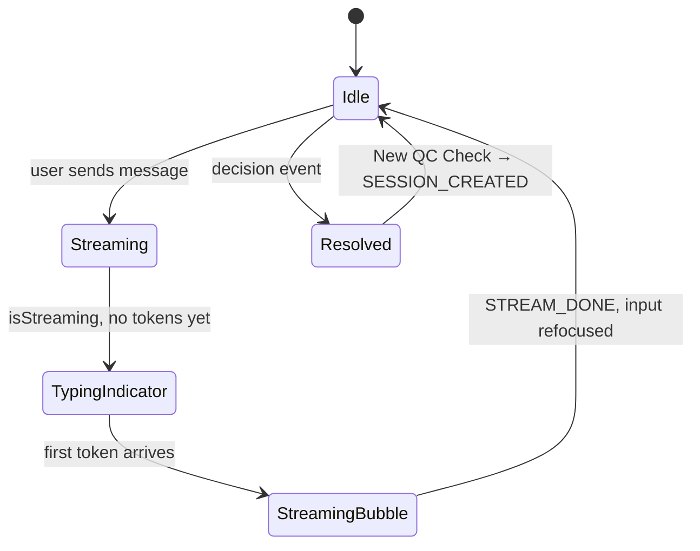

# MANA POCT — Front End

React + TypeScript chat interface for the QC Assistant. Streams assistant responses via SSE and renders live QC decision state.

## Stack

| Layer | Technology |
|-------|-----------|
| UI library | React 19 with TypeScript |
| Build tool | Vite 8 |
| Styling | Tailwind CSS 4 via `@tailwindcss/vite` |
| State | `useReducer` + `chatReducer` (no external store) |
| Streaming | Native `fetch` + `ReadableStream` (no EventSource) |
| Linting | ESLint (flat config, TypeScript + React Hooks rules) |
| Formatting | Prettier + `prettier-plugin-tailwindcss` |

## Project layout

```
front-end/
├── src/
│   ├── main.tsx              App entry point
│   ├── App.tsx               Root component (mounts Layout)
│   ├── index.css             Tailwind imports
│   │
│   ├── services/             Backend communication
│   │   ├── types.ts          TypeScript interfaces mirroring backend Pydantic schemas
│   │   └── client.ts         createSession() and other API calls
│   │
│   ├── hooks/
│   │   ├── useChatStream.ts  Sends messages, consumes SSE stream, dispatches to reducer
│   │   └── helper.ts         Raw SSE line parser (preserves spaces, handles CRLF)
│   │
│   ├── state/
│   │   └── chatReducer.ts    ChatState shape + all action handlers
│   │
│   ├── features/             Page-level composed components
│   │   ├── Layout.tsx        App shell (header + sidebar + main)
│   │   ├── ChatPanel.tsx     Assembles MessageBubble list + ProgressPanel + Composer + New QC Check
│   │   ├── ProgressPanel.tsx Four-variable status tracker + lot/serial DB hints
│   │   ├── DecisionCard.tsx  Final QC decision display (scenario badge + system action)
│   │   └── ChatBox.tsx       Thin wrapper for standalone chat box use
│   │
│   └── ui/                   Primitive / reusable components
│       ├── MessageBubble.tsx  User / assistant message bubbles (markdown rendered)
│       ├── Composer.tsx       Text input + send button (forwardRef focus handle, resolved state)
│       ├── TypingIndicator.tsx  Three-dot animated placeholder while waiting for first token
│       └── Button.tsx         Shared button primitive
│
├── eslint.config.js
├── vite.config.ts             Path alias: @/ → src/
└── .prettierrc.json
```

## Getting started

### Via Docker Compose (recommended)

```bash
# From repo root
make up
# Frontend: http://localhost:5173
```

### Standalone dev server

```bash
cd front-end
npm install
npm run dev
# Open http://localhost:5173
```

The app proxies `/api` requests to `http://localhost:8000` (configured in `vite.config.ts`).

## Scripts

| Command | Description |
|---------|-------------|
| `npm run dev` | Start Vite dev server with HMR |
| `npm run build` | Type-check + production build → `dist/` |
| `npm run preview` | Preview the production build locally |
| `npm run lint` | Run ESLint |
| `npm run prettier` | Format all source files |
| `npm run check-format` | Check formatting without writing |

## State management

All chat state lives in a single `ChatState` managed by `chatReducer`:

```ts
interface ChatState {
  sessionId: string | null;
  messages: Message[];
  extraction: ExtractionState | null;
  variableStatuses: Record<string, string>;   // populated by backend state SSE events
  decision: DecisionEvent | null;
  isStreaming: boolean;
  error: string | null;
}
```

The reducer handles these actions: `SESSION_CREATED`, `STREAM_TOKEN`, `STREAM_STATE`, `STREAM_DECISION`, `STREAM_ERROR`, `STREAM_DONE`, `USER_MESSAGE`.

`SESSION_CREATED` resets the full state — used on mount and when the user clicks **New QC Check** after a decision.

## Chat flow



| Phase | UI |
|-------|-----|
| Waiting for LLM | `TypingIndicator` (three bouncing dots, `aria-live="polite"`) |
| Tokens arriving | `MessageBubble` with streaming cursor |
| Turn done | Composer refocuses via `ComposerHandle.focus()` |
| Session resolved | Composer disabled + **New QC Check** button; calls `createSession()` |

## SSE streaming

`useChatStream` uses `fetch` with `ReadableStream` rather than `EventSource` to support custom request headers and `POST` bodies. The raw byte stream is decoded by `helper.ts`, which:

- Splits on `\n\n` block boundaries
- Strips only the required single leading space from `data: ` lines (preserves content spaces)
- Normalises `\r\n` to `\n`

## Key design decisions

- **No client-side rule re-derivation.** `ProgressPanel` displays `variableStatuses` exactly as returned by the backend `state` SSE events. The rules engine lives entirely in Python.
- **DB lookup hints.** When the backend populates `consumable.lot_number` or `historical.device_serial` (via operator input or mock DB lookup), ProgressPanel shows a small supplementary label (`Lot: …` / `DB: …`) under the relevant row.
- **`useReducer` over external store.** The chat state is self-contained enough that Redux/Zustand would be premature. `chatReducer.ts` keeps all transitions in one auditable place.
- **One session per QC check.** After a decision, the composer locks and **New QC Check** starts a fresh session. The backend rejects further messages on resolved sessions (HTTP 409).
- **Path alias `@/`** maps to `src/` so imports stay clean across the nested folder structure.
