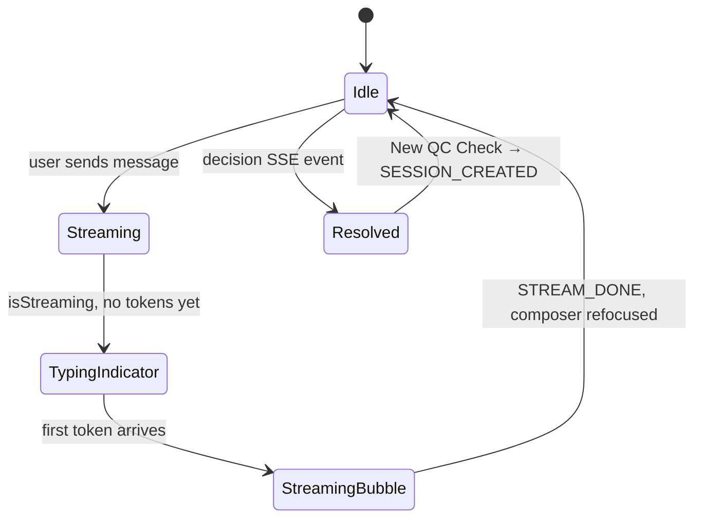

# MANA POCT — Front End

React + TypeScript chat interface for the QC Assistant. Streams assistant responses via SSE, renders live QC decision state, and applies a Material Design 3-inspired token system with full light/dark mode support.

## Stack

| Layer | Technology |
|-------|-----------|
| UI library | React 19 + TypeScript |
| Build tool | Vite 8 |
| Styling | Tailwind CSS v4 via `@tailwindcss/vite` (CSS-first, no config file) |
| Component variants | `class-variance-authority` (cva) |
| Class merging | `clsx` + `tailwind-merge` (extended for custom tokens) |
| Icons | `lucide-react` |
| State | `useReducer` + `chatReducer` (no external store) |
| Streaming | Native `fetch` + `ReadableStream` (no EventSource) |
| Linting | ESLint (flat config, TypeScript + React Hooks rules) |
| Formatting | Prettier + `prettier-plugin-tailwindcss` |

## Project layout

```
front-end/
├── src/
│   ├── main.tsx              App entry — mounts ThemeProvider + App
│   ├── App.tsx               Root component (mounts Layout)
│   ├── index.css             Tailwind v4 theme: tokens, dark mode, gradients
│   │
│   ├── context/
│   │   └── theme/
│   │       ├── ThemeContext.ts     React context type + createContext
│   │       ├── ThemeProvider.tsx   Persists & applies light/dark scheme
│   │       └── helper.ts           applyThemeClass, storage key, defaults
│   │
│   ├── services/
│   │   ├── types.ts          TypeScript interfaces mirroring backend Pydantic schemas
│   │   └── client.ts         createSession() HTTP call
│   │
│   ├── hooks/
│   │   ├── useChatStream.ts  POST + SSE consumer; dispatches to chatReducer
│   │   ├── useTheme.ts       Reads ThemeContext; throws outside ThemeProvider
│   │   └── helper.ts         SSE frame parser (takeCompleteFrames, parseFrame)
│   │
│   ├── state/
│   │   └── chatReducer.ts    ChatState shape + all action handlers
│   │
│   ├── lib/
│   │   └── cn.ts             clsx + extended twMerge (knows design tokens)
│   │
│   ├── pages/
│   │   └── ChatPanelPage.tsx  Owns chatReducer; composes ProgressPanel + ChatPanel
│   │
│   ├── layout/
│   │   ├── Layout.tsx        h-screen shell: gradient bg, Header, main, Footer
│   │   ├── Header.tsx        Sticky top bar: app name + theme toggle IconButton
│   │   └── Footer.tsx        Sticky copyright strip
│   │
│   ├── features/
│   │   └── chat-panel-page/
│   │       ├── ChatPanel.tsx       Message list + Composer + DecisionCard + New QC Check
│   │       ├── ProgressPanel.tsx   Horizontal 4-pill QC variable strip
│   │       ├── DecisionCard.tsx    Colour-coded final QC decision card
│   │       ├── ChatBox.tsx         Standalone SSE test harness (dev only)
│   │       ├── getRows.ts          Builds VariableRow[] for ProgressPanel
│   │       └── constants.ts        COLOR_STYLES and VAR_STATUS_STYLES maps
│   │
│   └── ui/                   Primitive / reusable components
│       ├── Button.tsx          cva variants: primary | outline | link
│       ├── IconButton.tsx      cva variants: ghost | default (circular)
│       ├── Chip.tsx            PENDING / PASS / WARN / FAIL status badge
│       ├── Composer.tsx        Textarea + send IconButton; forwardRef focus handle
│       ├── MessageBubble.tsx   User (pink) + assistant (white) bubbles with avatars
│       └── TypingIndicator.tsx Accessible three-dot bounce animation
│
├── eslint.config.js
├── vite.config.ts             Path alias: @/ → src/
└── .prettierrc.json
```

## Getting started

### Via Docker Compose (recommended)

```bash
# From repo root
make up
# Frontend: http://localhost:5173
```

### Standalone dev server

```bash
cd front-end
npm install
npm run dev
# Open http://localhost:5173
```

The app proxies `/api` requests to `http://localhost:8000` (configured in `vite.config.ts`).

## Scripts

| Command | Description |
|---------|-------------|
| `npm run dev` | Start Vite dev server with HMR |
| `npm run build` | Type-check + production build → `dist/` |
| `npm run preview` | Preview the production build locally |
| `npm run lint` | Run ESLint |
| `npm run prettier` | Format all source files |
| `npm run check-format` | Check formatting without writing |

## Design system

Tailwind v4 uses a **CSS-first** configuration — there is no `tailwind.config.js`.
All tokens are declared in `src/index.css` using `@theme {}` and map directly to utilities:

| CSS variable | Tailwind utility |
|---|---|
| `--color-primary` | `bg-primary`, `text-primary`, `border-primary` |
| `--color-surface` | `bg-surface`, etc. |
| `--spacing-md` | `p-md`, `m-md`, `gap-md` |
| `--text-body-sm` | `text-body-sm` (sets size + line-height + weight) |
| `--radius-lg` | `rounded-lg` |
| `--font-sans` | `font-sans` → Manrope |

### Dark mode

The `ThemeProvider` toggles `class="dark"` on `<html>`.
`index.css` declares `@custom-variant dark (&:where(.dark, .dark *))` and a `.dark {}` block
that overrides only the colour tokens that change between schemes.
All Tailwind utilities automatically pick up the correct token at render time.

The application background is a custom CSS class:

```css
.bg-app { background: linear-gradient(135deg, #748DAE 0%, #9ECAD6 100%); }
.dark .bg-app { background: linear-gradient(135deg, #101c36 0%, #0d2b33 100%); }
```

### `cn()` helper

```ts
import { cn } from '@/lib';
cn('px-md py-sm', isActive && 'bg-primary', className)
```

Uses `clsx` for conditionals and an **extended** `tailwind-merge` instance that knows
the project's custom color and typography tokens so class conflicts are resolved correctly.

### Button variants

```tsx
<Button>Primary CTA</Button>
<Button variant="outline">Secondary</Button>
<Button variant="link" size="sm">Inline toggle</Button>
<Button fullWidth>Full-width</Button>
```

### IconButton variants

```tsx
<IconButton aria-label="Toggle theme"><Moon size={20} /></IconButton>          {/* ghost */}
<IconButton variant="default" className="rounded-lg"><SendHorizonal /></IconButton>  {/* filled */}
```

## State management

All chat state lives in a single `ChatState` managed by `chatReducer`:

```ts
interface ChatState {
  sessionId: string | null;
  fsm: FsmState | null;            // drives ProgressPanel active pill
  messages: ChatMessage[];
  streamingText: string;           // accumulates before STREAM_DONE commits it
  extraction: ExtractionState | null;
  variableStatuses: Record<string, string>;  // from state SSE events
  decision: Decision | null;       // set once; locks composer
  isStreaming: boolean;
  error: string | null;
}
```

`SESSION_CREATED` performs a full state reset — used on mount and on **New QC Check**.

## Chat flow



| Phase | UI |
|-------|-----|
| Waiting for LLM | `TypingIndicator` (three bouncing dots, `aria-live="polite"`) |
| Tokens arriving | `MessageBubble` with animated streaming cursor |
| Turn done | Composer re-focuses via `ComposerHandle.focus()` |
| Session resolved | Composer disabled + **New QC Check** button |

## SSE streaming

`useChatStream` uses `fetch` + `ReadableStream` rather than `EventSource` to support custom request headers and `POST` bodies. The raw byte stream is decoded by `hooks/helper.ts`, which:

- Splits on `\n\n` block boundaries (`takeCompleteFrames`)
- Normalises `\r\n` → `\n`
- Strips only the required single leading space from `data: ` lines (preserves content spaces)
- Handles `token`, `state`, `decision`, `error`, `done` event types

## Layout architecture

The entire app fills the viewport without a page-level scrollbar. The trick is a strict flex height chain where every layer passes `min-h-0` downward so the browser never falls back to `auto` sizing:

```
div.h-screen.flex-col          ← viewport anchor
  Header                       ← shrink-0, natural height
  main.flex-1.min-h-0.flex-col ← fills remaining space
    section.flex-1.min-h-0.flex-col  ← ChatPanelPage
      div.shrink-0             ← ProgressPanel (never squished)
      div.flex-1.min-h-0       ← frosted-glass chat area
        div.flex-1.min-h-0.flex-col  ← ChatPanel
          div.flex-1.min-h-0.overflow-y-auto  ← scrollable message list
          div.shrink-0         ← Composer (never squished)
          div.shrink-0         ← New QC Check button (conditional)
  Footer                       ← shrink-0, natural height
```

**Why `min-h-0` everywhere:** flex items default to `min-height: auto`, which prevents them from shrinking below their content size. Without `min-h-0` on intermediate containers the message list can't grow to fill its parent, breaking the scroll boundary.

**Why `shrink-0` on ProgressPanel:** without it, the flex algorithm is permitted to squish the progress strip as the message list below it grows, causing both to fight over vertical space.

**Auto-scroll implementation:** the message list uses `scrollTop = scrollHeight` (direct DOM property) instead of `scrollIntoView`. `scrollIntoView` traverses every ancestor looking for scrollable containers — once the list becomes scrollable it triggers ancestor layout recalculations on every streamed token. Direct `scrollTop` manipulation is scoped entirely to the list div and has no side-effects on surrounding layout.

## Key design decisions

- **No client-side rule re-derivation.** `ProgressPanel` displays `variableStatuses` exactly as returned by the backend `state` SSE events. The rules engine lives entirely in Python.
- **DB lookup hints.** When the backend populates `consumable.lot_number` or `historical.device_serial`, `ProgressPanel` shows a small supplementary hint (`Lot: …` / `DB: …`) below the relevant pill.
- **`useReducer` over external store.** The chat state is self-contained — `chatReducer.ts` keeps all transitions in one auditable place.
- **One session per QC check.** After a decision, the composer locks and **New QC Check** starts a fresh session (HTTP 409 on reuse).
- **Path alias `@/`** maps to `src/` — imports stay clean across the nested folder structure.
- **DecisionCard uses fixed slate text.** The card always has a light-tinted background regardless of app theme, so text colours are hardcoded (`text-slate-700`) rather than using theme tokens to ensure readability in dark mode.
- **Tailwind v4 CSS-first.** No `tailwind.config.js` — all tokens, dark mode variant, spacing, typography, and gradients are in `index.css`. The `cn` helper extends `tailwind-merge` so custom tokens are conflict-resolved correctly.
